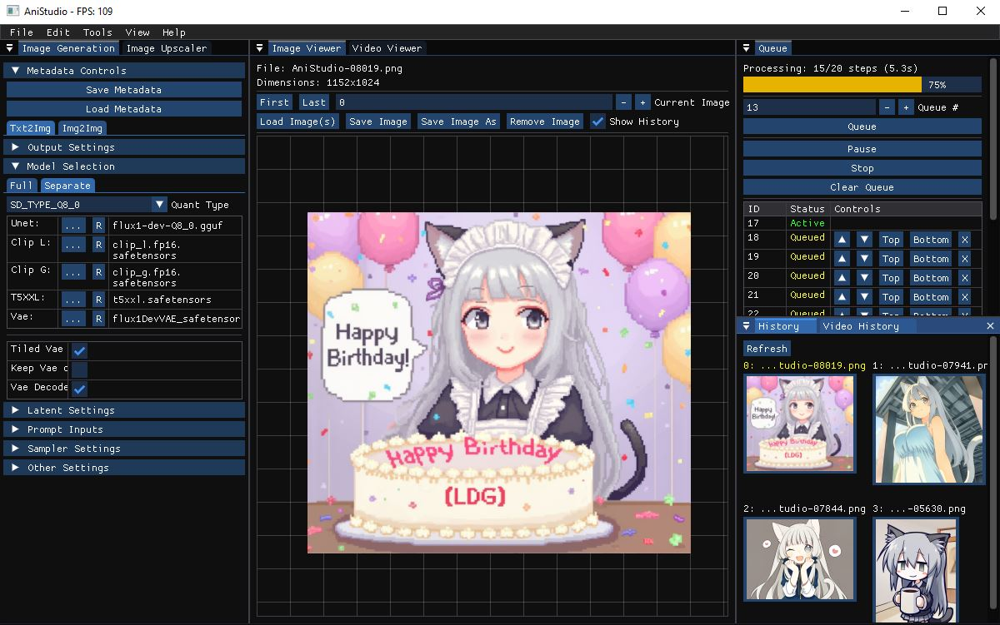

# Anistudio
An executable editor for image and video diffusion generation and editing projects written in C/C++ by utilizing [stable-diffusion.cpp](https://github.com/leejet/stable-diffusion.cpp) backend.

## Features
- Entity Component System for modular development with low technical debt
- Dockable and customizable Views to personalize your UI/UX experience
- Image inference (StableDiffusion.cpp)
- Cross-platform (Windows, Linux)
- Included UI editor for ease of development
- Extremely lightweight compared to alternatives

---
*Disclaimer: the application still has some threading issues so until those get sorted, releases will not be made. please build from source*

[How to build from Source](docs/Installation.md)

---

##TODO:
- mainly fix critical issues
- hot reload plugin manager
- python interop
- separate sdcpp into a separate build to reduce build build/compile times
- reduce bad allocations

## License

This project is dual-licensed under the **GNU Lesser General Public License v3.0 (LGPL-3.0)** and a **commercial license**.

### LGPL-3.0
If you use this project under the LGPL-3.0, you must:
- Provide the source code of any modifications to the LGPL-licensed parts.
- Allow users to replace the LGPL-licensed components with their own versions.

For full details, see the [LICENSE-LGPL-3.0.txt](LICENSE-LGPL-3.0.txt) file.

### Commercial License
If you prefer to use this project under a commercial license, please contact us at [your-email@example.com] to discuss terms. The commercial license allows:
- Static linking of the library in proprietary software.
- No obligation to provide source code.
- Priority support and additional benefits.

For more details, see the [LICENSE-COMMERCIAL.txt](LICENSE-COMMERCIAL.txt) file or contact legal@kframe.ai.

## Purpose
I created this application to leverage C/C++ for a highly modular and parallelized system capable of loading, inferencing, and training machine learning models, all within a unified UI. Existing UI solutions often rely on external tools for refining or editing, or suffer from runtime performance issues due to techstack limitations resulting in inconsistent rendering, slow loading, and cache misses. AniStudio is designed to maintain consistent performance under heavy loads, allowing users to multitask traditional media creation with AI-assistance, all in one seamless application with the freedom of C/C++.
