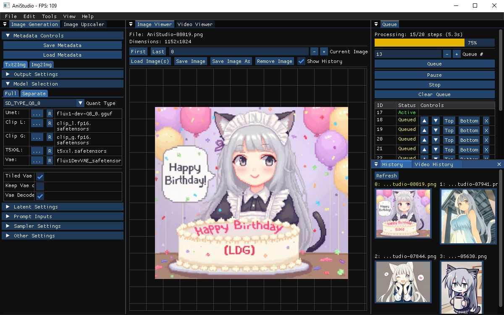

# Anistudio
An executable engine and editor for image, video and edit diffusion models written in C/C++ utilizing the [stable-diffusion.cpp](https://github.com/leejet/stable-diffusion.cpp) library.



## Features
- Entity Component System for modular development
- Dockable and customizable Views vie [Dear ImGui](https://github.com/ocornut/imgui)
- Cross-platform (Windows, Linux)
- standard media project management
- Included UI editor for ease of development
- Supported models:
  - Image Models
    - SD1.x, SD2.x, SD-Turbo
    - SDXL, SDXL-Turbo
      - !!!The VAE in SDXL encounters NaN issues under FP16, but unfortunately, the ggml_conv_2d only operates under FP16. Hence, a parameter is needed to specify the VAE that has fixed the FP16 NaN issue. You can find it here: [SDXL VAE FP16 Fix](https://huggingface.co/madebyollin/sdxl-vae-fp16-fix/blob/main/sdxl_vae.safetensors).
    - SD3/SD3.5
    - Flux-dev/Flux-schnell
    - Chroma
  - Image Edit Models
    - FLUX.1-Kontext-dev
  - Video Models
    - Wan2.1/Wan2.2
  - [PhotoMaker](https://github.com/TencentARC/PhotoMaker) support.
  - Control Net support with SD 1.5
  - LoRA support, same as [stable-diffusion-webui](https://github.com/AUTOMATIC1111/stable-diffusion-webui/wiki/Features#lora)
  - Latent Consistency Models support (LCM/LCM-LoRA)
  - Faster and memory efficient latent decoding with [TAESD](https://github.com/madebyollin/taesd)
  - Upscale images generated with [ESRGAN](https://github.com/xinntao/Real-ESRGAN)
- 16-bit, 32-bit float support
- 2-bit, 3-bit, 4-bit, 5-bit and 8-bit integer quantization support
- Accelerated memory-efficient CPU inference
    - Only requires ~2.3GB when using txt2img with fp16 precision to generate a 512x512 image, enabling Flash Attention just requires ~1.8GB.
- AVX, AVX2 and AVX512 support for x86 architectures
- Full CUDA, Metal, Vulkan, OpenCL and SYCL backend for GPU acceleration.
- Can load ckpt, safetensors and diffusers models/checkpoints. Standalone VAEs models
- Flash Attention for memory usage optimization
- Negative prompts
- [stable-diffusion-webui](https://github.com/AUTOMATIC1111/stable-diffusion-webui) style tokenizer (not all the features, only token weighting for now)
- VAE tiling processing for reduce memory usage
- Sampling method
    - `Euler A`
    - `Euler`
    - `Heun`
    - `DPM2`
    - `DPM++ 2M`
    - [`DPM++ 2M v2`](https://github.com/AUTOMATIC1111/stable-diffusion-webui/discussions/8457)
    - `DPM++ 2S a`
    - [`LCM`](https://github.com/AUTOMATIC1111/stable-diffusion-webui/issues/13952)
- Cross-platform reproducibility (`--rng cuda`, consistent with the `stable-diffusion-webui GPU RNG`)

---

## How To Install
1. Download the Release for your OS and Platform (Cpu and GPU architecture)
2. Unzip the compressed file
3. If you are using Windows and you don't have VS C++ redistributable installed, run the installer included with the release
4. If you downloaded a GPU specific backend, please consult the documentation: [How to Install GPU Dependencies](docs/installation.md)
5. Run the .exe in the ```./bin/``` directory
6. Have fun!

---

## How To Build
Main application and Libraries: 
[How to build with Linux GCC](docs/Building with GCC.md)
[How to build with Windows MSVC](docs/Building with MSVC.md)

Official Addons:
[How to build DiffusionAddon](docs/Building DiffusionAddon.md)

---

## TODO:
- [x] hot reload plugin manager
- [x] python interop
- [x] project management
- [ ] asset and heap managers
- [ ] separate sdcpp into shared libs
- [ ] reduce bad allocations
- [ ] nodegraph execution
- [ ] basic usage guide

## License

This project is dual-licensed under the **GNU Lesser General Public License v3.0 (LGPL-3.0)** and a **commercial license**.

### LGPL-3.0
If you use this project under the LGPL-3.0, you must:
- Provide the source code of any modifications to the LGPL-licensed parts.
- Allow users to replace the LGPL-licensed components with their own versions.

For full details, see the [LICENSE-LGPL-3.0.txt](LICENSE-LGPL-3.0.txt) file.

### Commercial License
If you prefer to use this project under a commercial license, please contact us at legal@kemonotech.ai to discuss terms. The commercial license allows:
- Static linking of the library in proprietary software.
- No obligation to provide source code.
- Priority support and additional benefits.


## Purpose
I created this application to leverage C/C++ for a highly modular and parallelized system capable of loading, inferencing, and training machine learning models, all within a unified UI. Existing UI solutions often rely on external tools for refining or editing, or suffer from runtime performance issues due to techstack limitations resulting in inconsistent rendering, slow loading, and unoptimized implementations. AniStudio is designed to maintain consistent performance under heavy loads allowing users to multitask traditional media creation and AI generated media with the freedom and power of C/C++.
